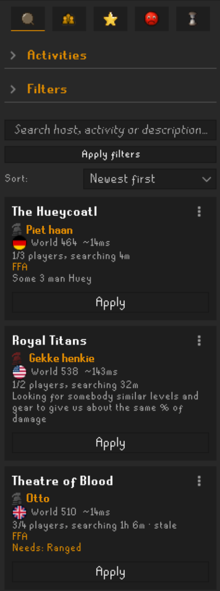
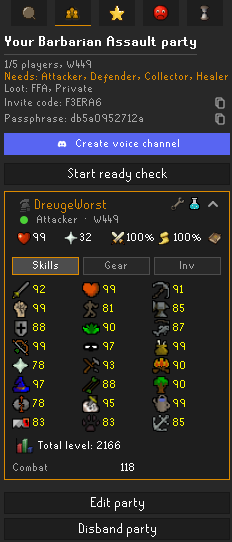
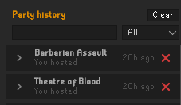
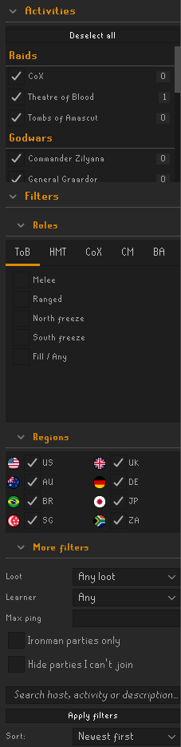
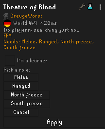
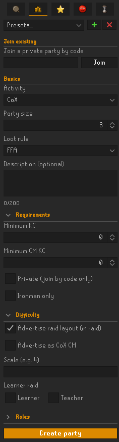
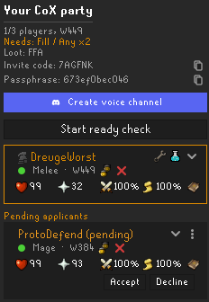
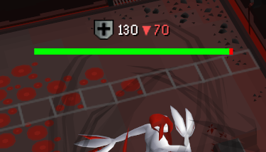

# OSParty

Find or host a group for raids, bosses and minigames, straight from a RuneLite side panel.

OSParty is a party finder built into RuneLite. Browse a live list of open parties, filter by
role or region, and apply with one click — or host your own and let OSParty match applicants
against the roles you still need. There's a local block list, a RuneWatch check on everyone in
your party, and optional Discord role badges and voice channels if your community wants them.

## Contents

- [What you get](#what-you-get)
- [The side panel](#the-side-panel)
- [Finding a party](#finding-a-party)
- [Hosting a party](#hosting-a-party)
- [Groups you didn't advertise](#groups-you-didnt-advertise)
- [Discord (optional)](#discord-optional)
- [Raid roles](#raid-roles)
- [Learner and teacher raids](#learner-and-teacher-raids)
- [In-game extras](#in-game-extras)
- [Safety and privacy](#safety-and-privacy)
- [Devices and your account](#devices-and-your-account)
- [Settings](#settings)
- [Learn more](#learn-more)

## What you get

- **Browse and apply** to open parties for 19 raids, bosses and minigames, filtered by role,
  region, ping, loot split and more.
- **Host in a few clicks**, with saved presets so you're not refilling the form every time.
- **Raid role matchmaking** for ToB, HMT, CoX, CM and BA — apply for a role a party actually
  still needs.
- **Invite friends directly** from your in-game friends list; accepted invites skip the
  applicant queue.
- **A party for the group you're already in**: OSParty spots a friends chat standing at an
  activity and offers to host one for it, and can take that chat's applicants without asking.
- **Learner and teacher tagging**, so new raiders and experienced ones can find each other on
  purpose.
- **RuneWatch warnings, a block list and reporting**, so you know who you're about to raid with.
- **Map pings, a defence tracker and ready checks** that work entirely client-side — nothing to
  enable elsewhere.
- **Optional Discord role badges and voice channels**, off unless you opt in.

## The side panel

Tabs are icon-only — hover one for its tooltip. Order when you're not in a party: Search ·
Party (create form) · Favorites · Blocked · History. Once you're in a party, that second tab
swaps to your roster under the same "Party" tooltip, and a sixth pencil "Edit party" tab
appears while a host is editing. The Party tab keeps a green underline while you're in a party.
Every tab shares a footer: GitHub and Discord links, a Devices button, an "N online" count, and
Discord account link/unlink.

**Search** — browse and filter the open party list, then apply. Covered in detail in
[Finding a party](#finding-a-party).

**Party** — the create form when you're not in a party (see
[Hosting a party](#hosting-a-party)), replaced by your roster once you are. Expand any member
for their Skills, Gear and Inventory.

**Favorites** — two lists, Favorites (parties whose host or any listed member you've starred)
and Friends (parties hosted by someone on your in-game friends list), rendered like Search
results — Apply, Cancel and cooldowns all behave the same.

**Blocked** — manage your local block list: one row per blocked player, each with an Unblock
button.

**History** — a local, capped record of the parties you've hosted or joined, newest first.
Expand a row to see who else was there and when they joined or left; search or filter it by
hosted/joined, or clear it entirely. Stored at `<runelite>/osparty/history.json` and never
leaves your client; how many it keeps is the Party history size setting.

You can be in only one party at a time. Applying elsewhere leaves your current party first, and
you have to leave or disband before creating a new one.

## Finding a party

The Activities section (open by default, grouped Raids / Godwars / Other) shows a count badge
per activity and highlights the one you're currently standing near. OSParty covers 19
activities:

- **Raids:** Chambers of Xeric (CoX) · Theatre of Blood · Tombs of Amascut
- **Godwars:** Kree'arra · General Graardor · K'ril Tsutsaroth · Commander Zilyana · Nex
- **Other:** The Nightmare · Corporeal Beast · Barbarian Assault\* · Zalcano · The Hueycoatl ·
  Yama · Royal Titans · Volcanic Mine\* · Castle Wars\* · Guardians of the Rift · Wintertodt

\* No hiscore kill count exists for Barbarian Assault, Volcanic Mine or Castle Wars, so there's
no min-KC bar to set for these three.

Below the activity picker, three collapsed sections hold the rest of the filters: **Roles** (a
tab per raid mode), **Regions** (a flag grid — US, UK, AU, DE, BR, JP, SG, ZA) and
**More filters** (loot rule, learner, max ping, ironman only, hide parties you can't join). A
free-text box searches host name, activity and description. Sort by Newest first, Oldest first,
Lowest ping or Closest to full — whichever you pick, parties hosted by an OSRS friend always
float to the top.

Each card shows the world and an estimated ping next to a country flag, how full the party is
and how long it's been searching, any tags (learner, loot rule, ironman-only), its KC
requirements, the roles it still needs, and for Chambers of Xeric, a scanned raid layout if the
host opted in. The button is context-sensitive: Apply, Log in, Your party, Cancel, In this
party, Iron only, Full, Wait Ns, Need KC or Checking KC…, and applying opens an inline role
picker with an optional "I'm a learner" tick.

Right-click a card (or use its 3-dot menu) for Look up on hiscores, Favourite, Block or Report
advertisement. Full parties are never listed, and hosts you've blocked are hidden by default. If
OSParty can't reach its service the panel shows "Not connected to OSParty" with a Reconnect
button; if you're logged out, every card's button reads Log in instead.

To join a private party, use "Join a private party by code" — that's on the Party tab, not
Search.

Your filters (activities, roles, loot, ironman, learner and which sections are expanded) are
remembered across sessions.

## Hosting a party

The Party tab's create form has a Presets row — save the current form as a named preset, or
just reuse whatever you created last time, since every successful create or edit is saved
automatically.

- **Basics** — activity, party size, loot rule (FFA, Split or Unspecified), and a
  200-character description.
- **Requirements** — minimum KC and a separate CM/HM/Expert KC, Private, and Ironmen-only. If
  you don't meet your own KC bar, the form warns you and won't let you create the party.
- **Difficulty** — Advertise raid layout (Chambers of Xeric only — OSParty maps the raid into
  its rooms as your party scouts it, matches what's found against known layouts, and can work
  out unscouted combat rooms from the possible rotations; readers see a "Layout: …" line on your
  search card), advertise as CM/HM, a ToA invocation level, CoX scale, and Learner/Teacher
  tagging.
- **Roles** — the team composition for ToB, HMT, CoX, CM or BA (see [Raid roles](#raid-roles)).

Create party opens the live room and switches the tab to Save changes for as long as you're
editing.

Once hosting, the tab becomes a management view: the roster, pending applicants with Accept and
Decline (you see their real gear, stats and KC before deciding), and the still-needed roles.
Kicking someone is a right-click on their row — Kick player or Kick and block player. Inviting a
friend is a right-click in your in-game friends list, "Invite to party" — that skips the
recipient straight past your applicant queue once they accept, so only invite people you'd have
accepted anyway. If you disconnect, your seat as an admitted member is held for 90 seconds;
reconnecting inside that window drops you straight back in.

Expanding a member's row shows their Skills, Gear and Inventory, plus their combat level and
kill count for the activity. Kill counts come from the public OSRS hiscores, looked up by your
own client rather than taken on trust. Personal bests sit alongside them for CoX, ToB, ToA, Nex,
Nightmare and Inferno, but those *are* self-reported — they're read from what RuneLite's
chat-commands plugin recorded on that player's machine, so they're only as accurate as their
own `!pb` history.

Transfer host hands the room to another admitted, online member. It happens immediately on
their end — they aren't asked to confirm first, so only use it on someone you'd trust with the
role. Disbanding offers the same choice as a dialog: transfer to a member and leave, disband for
everyone, or cancel (with a "don't ask me again" tick for next time).

## Groups you didn't advertise

Most raids aren't found on a party finder. They're found in a Discord, and what happens in game
is "join my friends chat, world 330" — at which point everyone involved is standing together and
hosting a party is a second organising step for a group that already exists.

So OSParty offers instead. When you're at one of the 19 activities with players from **your own**
friends chat on screen, a banner appears at the top of the panel:

> 3 players from your friends chat are here for Theatre of Blood.  **[Start]  [✕]**

Start opens the create form with that activity already selected (it's the same form as always, so
loot rule, KC bar and roles are still yours to set, and nothing is advertised until you press
Create party). ✕ dismisses that group for the rest of your session. Only the chat's owner is
asked — prompting everyone standing there would offer four more parties for one group — and
nothing is suggested while you're already in a party. Turn it off with Suggest a party for my
group.

**Accept my friends chat** (off by default) is the other half. With it on, an applicant who is
already in your friends chat and standing there with you is accepted without asking, the way an
invited player already is. Anyone on your block list or on the RuneWatch / We Do Raids watchlist
is never accepted this way, however close they're standing.

All of this is worked out on your own machine, from the friends chat, the map region and who is
on screen. Nothing about the group is sent anywhere unless you take the offer and host a party,
at which point it's an ordinary advertisement like any other.

## Discord (optional)

All Discord features are off unless you opt in, and none of them are required to use OSParty.

- **Role badges** — link your Discord account (an OAuth flow that opens in your browser) and any
  recognised roles — developer, content creator, beta tester, backer — show as a small badge
  next to you, on search cards and in party rosters. You can hide your own badges, or unlink at
  any time.
- **Voice channels** — a host can provision a Discord voice channel for the party and share the
  invite with the roster. Asking again just returns the same channel. The host can disconnect a
  kicked member from voice, and members who join or link later can request their own access,
  which the server grants after checking roster membership and a Discord link.

## Raid roles

Theatre of Blood, Chambers of Xeric and Barbarian Assault advertise a role composition. Each
raid difficulty mode has its own, separate role set, so a pick in one mode can't be matched
against a party in another:

| Mode | Roles |
|------|-------|
| **ToB** | Melee · Ranged · Freeze · North freeze · South freeze *(search only: Fill / Any)* |
| **HMT** (ToB hard mode) | Melee · Ranged · Freeze · North freeze · South freeze *(search only: Fill / Any)* |
| **CoX** | Melee · Mage · Runner · Fill |
| **CM** (CoX challenge mode) | Veng · Ancient · Normal spells · Fill |
| **BA** (Barbarian Assault) | Attacker · Defender · Collector · Healer *(search only: Fill / Any)* |

- **Hosting ToB/HMT**: the composition is fixed by party size, not chosen — a three-man gets a
  single combined Freeze (it covers both sides), and four- and five-man teams split it
  North/South, with a five-man running two Melee. The freeze roles are interchangeable when
  matching, so a North freezer still finds a three-man team looking for a plain Freeze.
- **Hosting CoX/CM**: you set a count per role yourself, with Fill absorbing whatever's left
  over.
- **Hosting BA**: flexible rather than counted — one of each of Attacker, Defender, Collector and
  Healer is required, then a single spare slot may double any one of those roles (never more
  than two of the same). You don't choose which role doubles; whoever applies decides.
- **Searching**: the Roles filter has a tab per mode. Tick the roles you're willing to fill —
  Fill / Any means "any role" — and a party matches if it still needs one of them. Applying
  prompts you to commit to one of its open roles.

The host's still-open roles update live as members join and leave, so search cards and the apply
prompt always show what's actually left.

## Learner and teacher raids

When creating a raid (ToA, ToB or CoX) you can tag it Learner or Teacher — the two are mutually
exclusive, and picking neither makes it a normal raid. When applying to any raid, an "I'm a
learner" tick appears on the apply card (governed by the Enable learner raid toggle setting); it
travels with your application so the host sees it on the applicant and in the roster, but it
isn't remembered between applications.

In-game, party members tagged as a learner or teacher get a small icon by their name and a
coloured tile marker; untagged members get neither. The icon and marker are independent
toggles, and each role's tile colour is configurable — see the Player markers settings.

## In-game extras

- **Map pings** — hold the ping hotkey (default the backtick key) and left-click a tile to ping
  it for the whole party. Incoming pings animate on the scene in the sender's colour, with an
  optional arrow at the screen edge for off-screen ones.
- **Party member names** — draws every party member's name above their head. If you also run
  RuneLite's Player Indicators plugin, OSParty defers to it instead of drawing over the top.
- **Defence tracker** — while the party drains a boss's defence with special attacks, shows its
  live defence next to the overhead HP bar and/or as a status-bar info box. This is entirely
  self-contained: it watches your special attack energy drop, works out which weapon you used
  and its projectile delay, and matches the resulting hitsplat — it does not use, enable or
  depend on RuneLite's Special Attack Counter plugin, or any other plugin. It also tracks magic
  defence draining from the accursed sceptre, Seercull and Eye of ayak, plus BGS overkill and any
  physical special that spills into magic defence (Ice Demon, Verzik). By default it keeps
  tracking outside a party too — turn that off in settings if you only want it during party
  content.

  

- **Ready checks** — anyone in the party can start one from the Party tab; blocked while you're
  inside a raid or on a different world from the host, with an overlay at the top of the screen
  while it runs.
- **Join prompts** — a host running Chambers of Xeric, Theatre of Blood or Tombs of Amascut can
  ask you, via an on-screen popup, to join their friends chat, notice board or obelisk group
  respectively. OSParty only surfaces the request; it never joins or teleports you.

## Safety and privacy

- **RuneWatch** — every roster member and applicant is checked against the public RuneWatch /
  We Do Raids scammer watchlist (the same combined `mixedlist.json` feed the official RuneWatch
  plugin uses). A flagged player gets a red RuneWatch warning badge under their name on the
  Party tab, so a host sees it before admitting anyone. The list refreshes every 15 minutes, and
  the check happens entirely on your machine — names are matched locally, so nobody's name is
  ever sent anywhere for this. Toggle it with RuneWatch warnings.
- **Block list** — star or block a player from a search card or a member's right-click menu.
  Blocking a host hides their parties from Search by default (Show blocked parties reveals them
  greyed out instead); a blocked applicant to your own party is handled per the Blocked
  applicant setting — warn you, auto-reject and notify, or auto-reject silently. You can't block
  yourself.
- **Report an advertisement** — right-click (or the 3-dot menu) on a party card for Report
  advertisement, which flags it for moderator review. It's deliberately never acknowledged: the
  server rate-limits reports silently, and replying would tell you which ones got through.
- **Hide my gear / Hide my inventory** — two Privacy & safety settings that stop your equipped
  gear or inventory (including rune pouch contents) from being shared with the rest of your
  party. Both off by default, same as everything else you broadcast.
- **What's self-reported vs server-authoritative** — who's actually in a party, who's pending
  and what its capacity is are answered by the server, not by any client's claim, so admission,
  capacity and kicks hold even against a modified client. What a member reports about itself —
  gear, inventory, combat stats, account type, chosen role, personal bests — is self-asserted
  and relayed to the rest of the party as-is; RuneWatch and the report/block tools are the
  backstop for anyone abusing that trust. Kill counts are the exception: they're never
  broadcast, because a client can't read another account's boss KC locally. Each viewer looks
  them up independently from the public OSRS hiscores, so a KC you see on a card or a roster is
  one your own client verified.
- **What leaves your client** — beyond talking to OSParty's own service, the plugin makes exactly
  two other outbound calls: fetching RuneWatch's `mixedlist.json` list, and querying RuneLite's
  own hiscore API for KC checks and the "Look up on hiscores" right-click option.

## Devices and your account

The first time you connect, the server issues your account a credential. OSParty stores it in
`<runelite>/osparty/credentials.json`, keyed by your account hash — deliberately not in
RuneLite's own config, since that's cloud-synced in plain text.

The Devices button in the panel footer opens a dialog listing every machine currently able to
sign in as you, with Rename and Revoke for each. If you sign in on a new device while an
existing one is already registered, you'll be asked to confirm it with a six-digit coupling
code.

A newly enrolled device starts out named after its enrolment date. Nothing about your machine
is read for the name — OSParty never sends your computer's hostname — and you can rename any
device from this dialog.

## Settings

All under RuneLite's OSParty plugin settings, grouped the same way as in the client.

### Panel & browsing

| Setting | What it does |
|---|---|
| Side panel priority | Where the OSParty icon sits in the sidebar — lower sits higher up. |
| Discord role badges | Show Discord role badges next to hosts in Search and members in your party. |
| Party history size | How many past parties the History tab keeps before dropping the oldest. |
| Show blocked parties | Show blocked hosts' parties greyed out instead of hiding them from Search. |
| Enable learner raid toggle | Show the "I'm a learner" tick when applying to a raid. |

### Hosting

| Setting | What it does |
|---|---|
| Default party size | Capacity pre-filled on the create-party form. |
| Max applicants shown | Cap on applicants listed in the in-game applicant overlay before "+N more". |
| Blocked applicant | What happens when a blocked player applies: warn you, auto-reject and notify, or auto-reject silently. |
| Skip disband confirmation | Don't ask for confirmation before disbanding your own party. |
| Suggest a party for my group | Offer to host a party when you're at an activity with your own friends chat. On by default; see [Groups you didn't advertise](#groups-you-didnt-advertise). |
| Accept my friends chat | Accept applicants already in your friends chat and standing with you, except blocked or watchlisted players. Off by default. |

### Notifications

| Setting | What it does |
|---|---|
| Chatbox notifications | Post OSParty events (applicants, requests, ready checks) to your chatbox. |
| In-game join prompts | As host, also show Accept/Decline for new applicants in the chatbox, not just the panel. |
| Desktop notifications | Send a desktop notification for invites, requests, applicants and ready checks. |
| Friend invites | How a party invite from a friend is surfaced: sidebar, in-game, both, or off. |
| Friends-chat join requests | Allow hosts to ask you, via a popup, to join their friends chat. |
| Join-request popup duration (s) | How long the friends-chat/notice-board join-request popup stays up. |

### Event sounds

All off by default.

| Setting | What it does |
|---|---|
| Ready-check sounds | Play a sound when a ready check starts, and when everyone's ready. |
| Friends-chat request sound | Play a sound when a host asks you to join their friends chat. |
| Kick sound | Play a sound when you're kicked from a party. |
| Ping sound | Play a sound when a party member drops a map ping. |

### Privacy & safety

| Setting | What it does |
|---|---|
| Hide my inventory | Don't share your inventory (including rune pouch contents) with the party. |
| Hide my gear | Don't share your equipped gear with the party. |
| RuneWatch warnings | Warn when a member or applicant is on the RuneWatch / We Do Raids watchlist. |

### Map pings

| Setting | What it does |
|---|---|
| Map pings | Show party members' pings on screen, and let you ping tiles for the party. |
| Ping hotkey | Hold this key and left-click a tile to ping it (default the backtick key). |
| Your ping colour | Colour your own pings and name label appear in, for everyone. |
| Ping duration (ms) | How long a ping animates and stays visible. |
| Off-screen ping arrows | Show a screen-edge arrow pointing at pings that are off-screen or behind you. |

### Player markers

| Setting | What it does |
|---|---|
| Learner/teacher name icons | Show an icon by the name of tagged party members. |
| Learner/teacher tile markers | Highlight the tile of tagged party members. |
| Marker tile fill opacity | Maximum opacity of the learner/teacher tile fill. |
| Teacher colour | Colour of the teacher tile marker. |
| Learner colour | Colour of the learner tile marker. |
| Party member names | Draw every party member's name above their head in the scene. |
| Party name colour | Colour of the name drawn above party members. |

### Defence tracker

| Setting | What it does |
|---|---|
| Show next to HP bar | Show a monster's live defence on the scene, next to its health bar. |
| HP-bar position | Where the scene defence display sits relative to the monster. |
| Show in status bar | Also show the monster's live defence as an info box in the status bar. |
| Show before any spec | Show defence at its starting level immediately, instead of waiting for the first drain. |
| Show full level | For monsters with a defence floor, show the full level rather than the amount above it. |
| Low defence threshold | Defence at or below this (above the floor) uses the low-defence colour. |
| High defence colour | Colour when defence is above the low threshold. |
| Low defence colour | Colour when defence is at or below the low threshold. |
| Capped defence colour | Colour when defence is fully drained. |
| Scene text size | Font size for the on-scene defence display. |
| Scene text background | Draw a translucent plate behind the scene text for legibility. |
| Show magic defence | Also show magic defence draining from the accursed sceptre, Seercull or Eye of ayak. |
| Magic defence as | Show the magic-defence bonus, the percentage of the starting roll, or both. |
| Magic defence colour | Colour of the magic-defence readout. |
| Track outside a party | Keep tracking defence drains outside a party too (on by default). |

## Learn more

- [docs/PROTOCOL.md](docs/PROTOCOL.md) — the wire protocol, for a compatible client or server.
- [docs/ARCHITECTURE.md](docs/ARCHITECTURE.md) — how the listing service and live party fit
  together, and what's stored where.
- [docs/DEVELOPING.md](docs/DEVELOPING.md) — building the plugin and running it against a local
  listing service.
- [Discord](https://discord.gg/EtMRxTHXWJ) — support, feedback, or people to raid with.
- [Issues](https://github.com/osparty/osparty/issues) — bug reports and feature requests.
